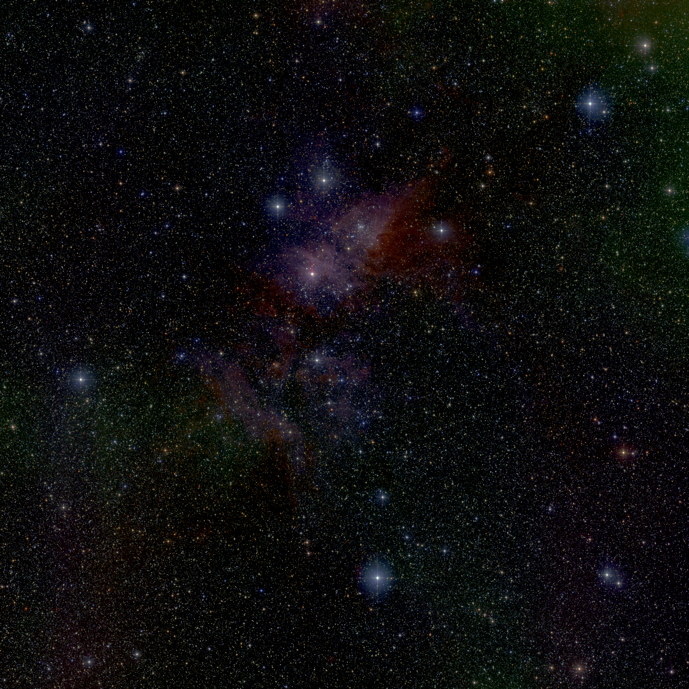

# Run the Montage workflow with Steep 

This repository demonstrates how to run the
[Montage workflow](http://montage.ipac.caltech.edu/) with
[Steep](https://github.com/steep-wms/steep).

## Step 1: Run the Docker image

We created a Docker image that contains Steep and the Montage toolkit. Run the
image in the background with the following command:

    docker run --name steep-montage --rm -d -p 8080:8080 \
      -e STEEP_HTTP_HOST=0.0.0.0 -v $(pwd)/data:/data/montage \
      steep/steep-montage

Wait until Steep has started. You can either run `docker logs steep-montage`
to the see log output or go to <http://localhost:8080> to open Steep's web
interface.

## Step 2: Submit a workflow

We prepared the following workflows for you:

<dl>
<dt>workflow/montage.yaml</dt>
<dd>Calculates a greyscale image for the 2MASS J-band. Runs the Montage toolkit commands sequentially.</dd>
<dt>workflow/montage_parallel.yaml</dt>
<dd>A parallelized version of <code>workflow/montage.yaml</code> that can be used to run the Montage workflow in a <a href="https://github.com/steep-wms/steep-montage-aws">distributed environment</a>. Requires multiple Steep agents to be deployed to unfold its full potential in terms of performance compared to the sequential version, but can be run on a single machine as well.</dd>
<dt>workflow/montage_parallel_rgb.yaml</dt>
<dd>Calculates an RGB image based on the K-, H-, and J-bands. Parallelized version.</dd>
</dl>

Submit one of the workflows as follows:

    curl -X POST http://localhost:8080/workflows --data-binary @workflow/montage_parallel_rgb.yaml

Go to <http://localhost:8080/workflows> to open Steep's web interface and
monitor the progress of the workflow. Wait until it is completed.

*HINT:* You may follow the instructions in the
[steep-montage-aws repository](https://github.com/steep-wms/steep-montage-aws)
if you want to run the parallel workflows on the AWS cloud.

## Step 3: Extract results

After the workflow has finished, you can extract the final mosaic from the Docker
container:

    docker cp steep-montage:$(docker exec steep-montage find /tmp -name '*.jpg') .

It should look like the [image below](#final-result).

## Step 4: Stop Steep

Finally, run the following command to remove the Docker container:

    docker kill steep-montage

### Final result

## Optional: Customizing the source area

By default, the workflows in this repository calculate a 2.8
square degrees mosaic of 2MASS images (J-, H-, and K-band) centred on
NGC 3372 ([Carina Nebula](https://en.wikipedia.org/wiki/Carina_Nebula)).

If you want to generate a mosaic for another location or celestial object,
open one of the workflow YAML files and customize the variables `survey`,
`location`, `width`, and `height`. Then submit the workflow again. Nothing else
has to be changed. The workflow dynamically adapts to the new parameters.

## Optional: Download test data

The workflow in this repository is fully self-contained. It automatically
downloads the raw images and then generates the Mosaic. If the workflow has
been executed before, it uses the already downloaded imagery from the `data`
directory and skips the download.

If you wish, you can also download the raw images manually before executing the
workflow. If you already have the [Montage toolkit](https://github.com/Caltech-IPAC/Montage)
and [aria2](https://aria2.github.io/) installed on your computer, you can simply run:

    ./scripts/download_data.sh

Otherwise, run the script inside a Docker container:

    docker run -it -v $(pwd)/data:/download/data \
      --entrypoint /download/scripts/download_data.sh \
      steep/steep-montage

*NOTE:* The dataset has a total size of about *1.3 GB*. The download will take
quite some time (depending on your Internet connection).

**IMPORTANT: the script deletes the contents of the `data` directory! Make sure
you know what you are doing.**

## License

The files in this repository are licensed under the
[Apache License, Version 2.0](http://www.apache.org/licenses/LICENSE-2.0).

Unless required by applicable law or agreed to in writing, software
distributed under the License is distributed on an "AS IS" BASIS,
WITHOUT WARRANTIES OR CONDITIONS OF ANY KIND, either express or implied.
See the License for the specific language governing permissions and
limitations under the License.

## Montage License

The workflow uses the [Montage toolkit](https://github.com/Caltech-IPAC/Montage)
released under a [BSD 3-clause license](https://github.com/Caltech-IPAC/Montage/blob/master/LICENSE).

Copyright (c) 2014 California Institute of Technology, Pasadena, California.

THIS SOFTWARE IS PROVIDED BY THE COPYRIGHT HOLDERS AND CONTRIBUTORS "AS IS" AND
ANY EXPRESS OR IMPLIED WARRANTIES, INCLUDING, BUT NOT LIMITED TO, THE IMPLIED
WARRANTIES OF MERCHANTABILITY AND FITNESS FOR A PARTICULAR PURPOSE ARE
DISCLAIMED. IN NO EVENT SHALL THE COPYRIGHT HOLDER OR CONTRIBUTORS BE LIABLE
FOR ANY DIRECT, INDIRECT, INCIDENTAL, SPECIAL, EXEMPLARY, OR CONSEQUENTIAL
DAMAGES (INCLUDING, BUT NOT LIMITED TO, PROCUREMENT OF SUBSTITUTE GOODS OR
SERVICES; LOSS OF USE, DATA, OR PROFITS; OR BUSINESS INTERRUPTION) HOWEVER
CAUSED AND ON ANY THEORY OF LIABILITY, WHETHER IN CONTRACT, STRICT LIABILITY,
OR TORT (INCLUDING NEGLIGENCE OR OTHERWISE) ARISING IN ANY WAY OUT OF THE USE
OF THIS SOFTWARE, EVEN IF ADVISED OF THE POSSIBILITY OF SUCH DAMAGE.
